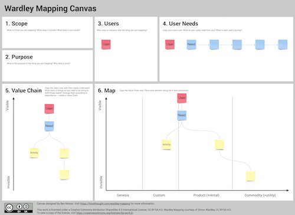

# Workshop Building Block - New Year's Eve Party

## Executive Summary

The page below contains description, facilitator's guide and resources associated with a 'New Year's Eve Party' exercise, which is supposed to help workshop participants to gain confidence in their mapping knowledge and prepare a map in a business-neutral environment. This building block is auxiliary - it must be followed by mapping a business challenge to get something tangible.

**Licence:** CC-BY-SA

**Intended Audience:** Wardley Mapping facilitators & trainers

**Activity duration:** 45-75 minutes. 

## Prerequisites
* Participants have to have a minimal understanding of Evolution and know how is the map built. 
The knowledge does not have to be very deep, 10-15 explanation of what a map is is usually sufficient.
* Participants must understand and accept the reason why they are doing the exercise, 
which is to practice Wardley Mapping in a safe environment before jumping into the problem they want to tackle with mapping.
* It is advised to showcase at least one example of a situation where mapping provided unexpected value. 
One of Simon's stories will do, but it is much better to have something personal and relevant for the audience. 
Some people may have heard about mapping and they may recognise it as an IT thing and categorise mapping not useful for them.
Asking people to not judge mapping before the workshop ends is advised.
* It is worth to have a business challenge identified at the beginning of the workshop and point out to it just before this exercise. 
'We are doing this exercise to get practical with Wardley Mapping, which provided `that value` in `the use case`, 
and we hope you will get similar value out of it when you will apply mapping to your business challenge.
* Participants must be split into groups between 4 to 6 members. In larger groups, some people may not participate in the discussion. 
* Miro Board design should accomodate at least three major sections:
  * A board for a walkthrough
  * Boards for the breakout groups
  * A Panel for Q&A Session
* A reference workshop whiteboard design can be found below:

* [Ben Mosior's](https://twitter.com/HiredThought) are a good replacement of plain Wardley Mapping templates, as they explicitely guide
participants through the process:

## The exercise workflow

### Challenge statement (5 mins)

This is a moment in which a facilitator briefs the group about the task. The brief should cover:
* Why the group is doing the exercise? ('To first-hand experience the process and gain confidence'). Self-doubt at this moment is very common and the group is likely to be uncomfortable.
* The description of activities that participants should undertake. Those usually include:
  * Choosing a spokesperson at the beginning that will present results of the work to the wide audience. In case of technical limitations,
  the spokesperson acts like a map owner, which is useful if it is necessary to fallback on screen sharing and power point. Miro is not allowed 
  everywhere due to the security concerns.
  * Deciding upon group's vision. What kind of party do they want to throw and what will attract participants, given the competition between parties? 
  * Identification of stakeholders. Which of them are the stakeholders that should be positioned at the top of the map? What value will they get?
  * Identification of components, assignement of Evolution phases.
  * Preparing a story for a wider audience, because not all people can read maps.
  * Iterative nature of the exercise. Participants are likely to discover that the vision determines the selection of components and that available components influence the vision. Some tough compromises may be required, and this is where the value is. We are making conflicts explicit.
Challenge statement can be also added to the whiteboard, so it is easily accessible to everyone.

### Walkthrough (5 mins)
To further improve the process, it may be worth to do a short walkthrough demonstrating how you, as the facilitator, would start the whole process.
** Important: ** During walkthrough, make sure you cover the difference between custom-built and utility music. Participants notorously put the component 'Musis' into the map without really giving much thought to it, so you, as the faciliator, have to demonstrate what it is the difference between custom-built music (have it composed just for me, custom selection), product (band, TV celebration) or utility (Spotify NY playlist). Mention the same approach applies to food and other components. Mention that custom-build components are usually deemed to be of high value.

[] TBD: sample video

### Mapping in breakout groups (20-30 mins)
Check each group whether they are making progress. Unfortunately, if the workshop is remote, all interactions are incredibly disturbing to the process, so do not intervene if the group is moving forward. They do not have to finish the task, but they need to start going. It may be worth to provide participants with a list of guiding questions:
* Who is the most important value receiver?
* What causes the stakeholders to participate in your project rather than any other project?
* Have you covered end-to-end journey (awareness, invitations, getting back home)?
* Do you know how the venue will look like and whether it is important?
* Do you know what is the difference between custom-built music and utility music?
* How do you know that the music will fit your guests?
* Do all the components make a coherent initiative?
* Who will pay for all of this?

### Stories (number of groups * 3 mins)
Ask each spokesperson to explain how their party will look like (1-2 sentences), and how they have approached mapping. If time permits, allow questions and comments but proceed with caution. By this time, people are usually very relaxed and playful, and the discussion can spin out of control.

### What was new or challenging?  - discussion (15 mins)
Ask participants to list things that were new or challenging. Group them and explain as needed.

### Closing
* Praise the group for the effort.
* Emphasise that communication is more important than the artifact.
* Explain how the same process will be used to create a shared situational awareness for the whatever challenge they do face. 
* Proceed into the next part of the workshop.

## FAQ

### Participant questions

#### Why are we doing this?
Some people sit in the workshop because they have to, not because they want to. 
'We want to practice Wardley Mapping in a neutral domain to build confidence in using the framework, and then apply the framework for the business challenge.'
#### I hate New Year's Eve Parties / Parties at all!
Some people do not like to celebrate NY. Acknowledge that it is ok to not like NY or parties, point out the true value of the exercise (getting used to mapping), and offer a few suggestions:
* the person may try to convince the group to do an alternative celebration (f.e. for people that do not like parties)
* the person may try to convince the group to organise a charity show instead and support a cause
* the person may focus on the process and what the group wants to do. It is actually a very good roleplay when some people do not like the initiative.
The goal is to shift the focus from the party to mapping.
#### What kind of party it should be?
You decide. There is no restrictions except it made overall sense.
